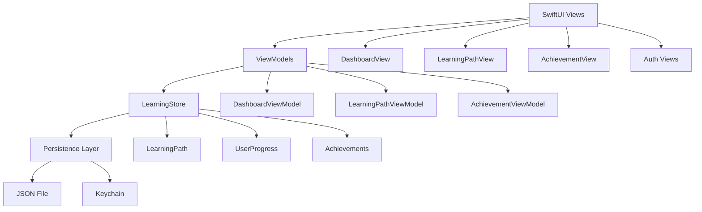
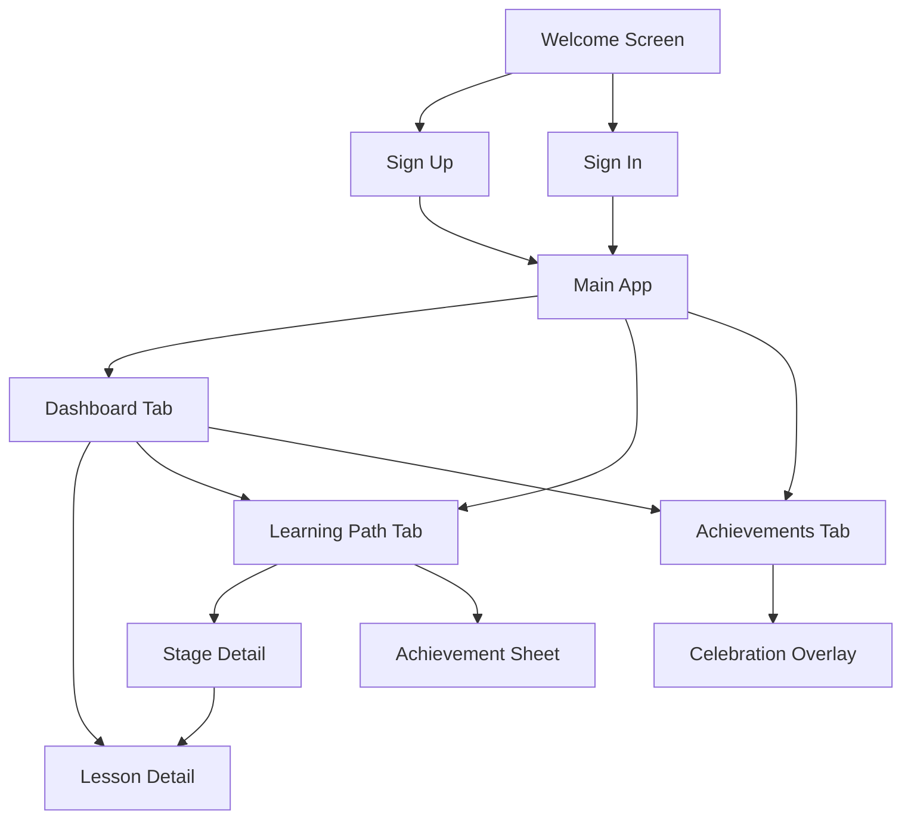
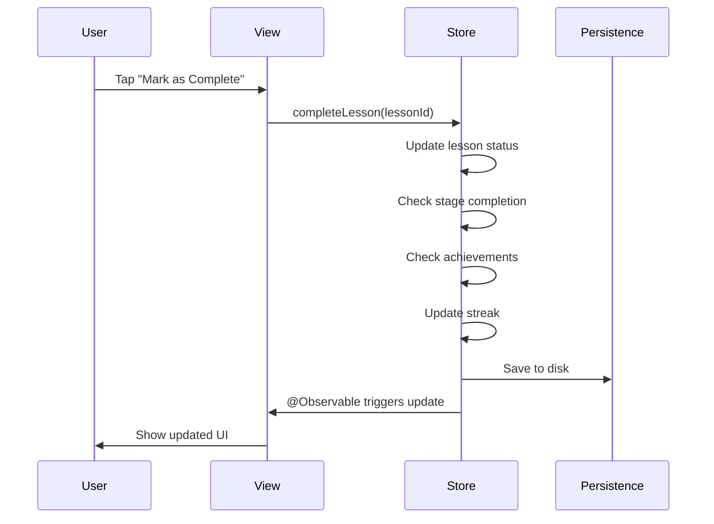
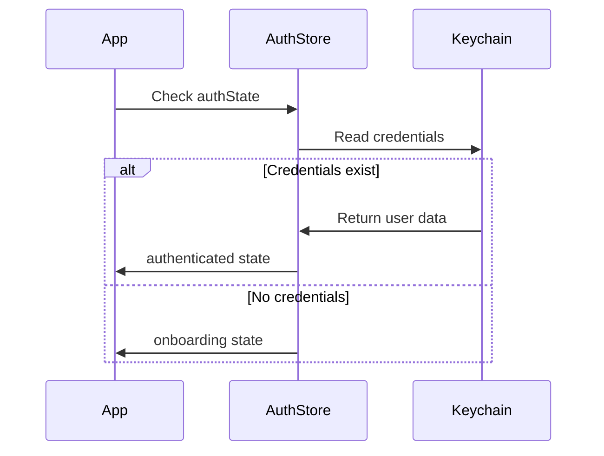

# Learning Progress App

An iOS app built with SwiftUI for tracking learning progress through structured paths. Uses MVVM with a centralized store, reactive state management, and secure authentication.

## Overview

This app helps users track their learning journey with a clean interface and gamification elements. It includes a personalized dashboard, interactive learning paths, achievements, and progress tracking.

Key features:
- Personalized dashboard with daily lesson recommendations
- Interactive learning paths with a serpentine stage layout
- Achievement system with automatic badge unlocking
- Progress tracking with streak counters
- Secure authentication using Keychain
- Data persistence across app restarts
- Full localization support (English, Spanish, French)

## Getting Started

### Requirements

- Xcode 15.0+
- iOS 17.0+
- macOS Ventura+ (for development)
- Swift 5.9+

### Installation

1. Clone the repository
2. Open `task.xcodeproj` in Xcode
3. Select a simulator or device (iPhone 15 Pro works well)
4. Build and run (Cmd + R)

### Running Tests

Press `Cmd + U` to run all tests. Test files are in the `taskTests` target.

### Fonts

The app uses the Aeonik font family. All font files are included and registered in `Info.plist`:
- Aeonik-Light, Regular, Medium, Bold
- RegularItalic, BoldItalic, MediumItalic
- ThinItalic

## Architecture

The app follows MVVM with a centralized store pattern. Here's how it's structured:



The main idea is that `LearningStore` holds all the mutable state. ViewModels read from it and trigger updates, which then propagate reactively to all views. This avoids manual synchronization between screens.

Key components:

- **LearningStore**: Single source of truth for learning data. When you complete a lesson here, all screens update automatically.
- **ViewModels**: Expose computed properties that delegate to the store. They handle UI-specific logic but don't own the data.
- **DependencyContainer**: Provides the shared store and ViewModel factories via SwiftUI's Environment.
- **LearningServiceProtocol**: Protocol for data access. Currently uses a mock implementation but can be swapped for a real API.
- **AppRouter**: Manages tab selection and navigation paths. Tapping the same tab twice resets its navigation stack.
- **AuthStore**: Handles authentication state and stores credentials in Keychain.

## Navigation

Here's how users move through the app:



## Features

### Authentication

The welcome screen uses Lottie animations and gradient backgrounds. Sign up includes validation for name length, email format, password strength, and password matching. Sign in verifies credentials against Keychain. Sessions persist automatically and restore on app launch.

### Dashboard

The dashboard shows a time-based greeting that changes throughout the day (morning, afternoon, evening, night). It displays personalized motivational messages based on your progress and streak. The "For Today" card shows the next lesson and navigates to lesson details. There's also a learning path summary with progress and a badges row showing earned achievements. The streak counter tracks consecutive learning days.

### Learning Path

The learning path uses a serpentine (zigzag) layout with two columns. Badges are connected with smooth bezier curves drawn using Canvas and PreferenceKey. Each badge has three states:
- Completed (purple) - shows achievement sheet on tap
- Current (blue with progress ring) - navigates to stage detail
- Locked (gray) - disabled

Completing all lessons in a stage automatically unlocks the next one.

### Achievements

Achievements unlock automatically when you hit milestones:
- Milestone: First Steps, Halfway Hero, Grand Master
- Streak: Dedicated (3 days), Week Warrior (7 days), Streak Legend (30 days)
- Mastery: Code Starter, Version Pro, UI Artisan, Data Wizard, Architect
- Special: Speed Learner

The achievement sheet includes animations, badge flip effects, and social sharing. You can filter achievements by category.

### Lesson Completion

When you complete a lesson:
1. Tap "Mark as Complete"
2. Celebration animation plays
3. Store updates lesson status, progress, and checks for stage/achievement unlocks
4. Streak updates
5. All screens update automatically
6. Milestone alerts show for stage completions

### Data Persistence

Progress is saved to `Application Support/Progressa/learning_progress.json` after each lesson completion. Credentials are stored securely in Keychain. When the app is deleted, iOS automatically removes all stored data (both files and Keychain items).

### Localization

The app supports English, Spanish, and French. All strings use String Catalogs (`.xcstrings` format). The L10n helper provides type-safe localization functions for formatted strings and pluralization.

## Design System

### Typography

Uses Aeonik font family with semantic tokens:
- Callout: Medium 15pt
- Footnote: Regular 13pt
- Caption Small: Regular 11pt

### Colors

Primary colors are indigo-based (`#4B3F8F`, `#6C5FBC`, `#8636E8`). Accent colors include orange, amber, and coral. Success green, background grays, and text colors follow iOS conventions.

### Spacing

Uses a 4-point grid system (4, 8, 12, 16, 24pt).

### Components

Cards use rounded corners (8pt small, 16pt large) with subtle shadows. Gradients are used for primary actions and streak indicators.

## Dependencies

- **DotLottie iOS** (v0.12.1) - For Lottie animation rendering
- System frameworks: SwiftUI, Foundation, Security, Combine

## Testing

Tests cover models, store logic, and view models. The store is tested for lesson completion, stage progression, achievement unlocking, and streak tracking. ViewModels are tested through their store interactions. No network mocking needed since the store is the source of truth.

## Project Structure

```
task/
├── taskApp.swift
├── ContentView.swift
├── Info.plist
├── DI/
│   └── DependencyContainer.swift
├── Services/
│   ├── LearningService.swift
│   ├── LearningStore.swift
│   ├── AuthStore.swift
│   ├── KeychainHelper.swift
│   └── LearningProgressPersistence.swift
├── Navigation/
│   └── AppRouter.swift
├── Models/
│   ├── LearningModels.swift
│   └── MockData.swift
├── ViewModels/
│   ├── DashboardViewModel.swift
│   ├── LearningPathViewModel.swift
│   └── AchievementViewModel.swift
├── DesignSystem/
│   ├── AppTheme.swift
│   ├── L10n.swift
│   └── Components/
│       ├── LottieView.swift
│       └── ProgressBarView.swift
├── Views/
│   ├── Auth/
│   ├── Dashboard/
│   ├── LearningPath/
│   └── Achievement/
├── Animations/
└── Resources/
    └── Localizable.xcstrings
```

## Technical Details

### State Management

Uses iOS 17's Observation framework with `@Observable`. The `LearningStore` centralizes all mutable state, and changes propagate automatically to all views.

### UI Features

The serpentine connectors use Canvas with PreferenceKey for precise positioning. Badge flip animations use 3D rotation. Celebration sequences use staggered spring animations. Lottie handles loading states and success animations.

### Security

Credentials are stored in Keychain with `kSecAttrAccessibleWhenUnlockedThisDeviceOnly`, which ensures they're deleted when the app is uninstalled. The service name uses the app's bundle identifier for proper scoping.

### Persistence

Progress is saved as JSON in Application Support. Files are automatically deleted by iOS when the app is uninstalled. The app handles load failures gracefully by falling back to default state.

### Localization Implementation

All strings use `String(localized:)`. The L10n helper provides functions like `stageOfTotal()`, `lessonsProgress()`, `streakDays()`, and `badgeCount()` for formatted strings with proper pluralization.

To add a new language:
1. Open `Localizable.xcstrings` in Xcode
2. Add the language
3. Translate the strings
4. Build and test

## Data Flow

Here's what happens when you complete a lesson:



And here's the authentication flow:



## Models

- **Lesson**: Individual learning unit with title, subtitle, duration, completion status
- **Stage**: Collection of lessons with state (completed/current/locked) and progress
- **LearningPath**: Complete learning journey with multiple stages
- **Achievement**: Badge with category, earned state, unlock date
- **UserProgress**: Aggregated metrics (streak, lessons completed, achievements)
- **UserProfile**: User info (name, email, join date)
- **AuthState**: Authentication state enum

## Code Style

Views use PascalCase with "View" suffix. ViewModels use "ViewModel" suffix. Functions use camelCase with descriptive verbs. One main type per file, with MARK comments for organization.

## Future Ideas

Some things that could be added:
- Cloud sync across devices
- Multiple learning paths
- Social features and leaderboards
- Push notifications for daily reminders
- Dark mode support
- iPad-optimized layouts
- Home screen widgets
- Backend API integration
- UI automation tests

## License

This project is for educational and demonstration purposes.

## Author

Samson Oluwapelumi

Created: February 8, 2026
